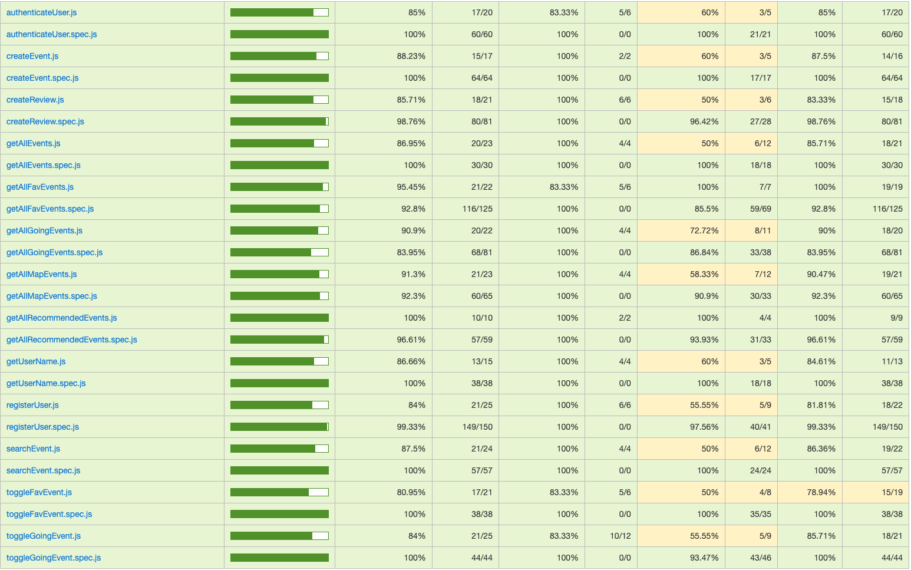

# Cities

Cities is an application designed to explore, create, and manage events within different cities. 
The primary objective is to connect users to events and provide tools for users to search for, 
create, and modify events by location and other key details.

## Functional

The application offers a platform for users to interact, explore cities, and stay informed about city-based events through:

- A main section where users can create, modify, and delete their own events.
- An interactive map or list to display events by location.
- A search tool to find events by title, or description.

### Use Cases

User
- Create event
- Create a review
- List events by location
- Search events by title, or caption
- Modify own event
- Delete own event
- Explore cities and view events
- Explore events by date

### UX | UI Design
[Figma](https://www.figma.com/proto/2Jqh5rduEoNJAEK8olefch/ISDI-Project-%7C-cities?page-id=47%3A270&node-id=83-33&node-type=canvas&viewport=-303%2C877%2C0.39&t=5vC2tVC4q8nyme1o-1&scaling=scale-down&content-scaling=fixed&starting-point-node-id=83%3A33)

## Technical

### Blocks

- App (user interface)
- API (core logic)
- DB (data storage)

### Packages

- api (server)
- cor (core logic dependency to api)
- com (common dependencies to api and app)
- app (client)
- doc (project documentation)

### Data Model

User 
- id (auto mongoose generate)
- name (string)
- surname (string)
- email (string)
- password (string)
- avatar (string, optional)
- fav ([Event.id])
- going ([Event.id])

Event
- id (auto mongoose generate)
- author (User.id)
- title (string)
- image (string, optional)
- caption (string)
- location ([Number, Number])
- Date (Date)
- Time (hh:mm)
- Reviews ( [{ author: User.id, rating: (number), comment: (string) }] )
- going ([User.id])

### Technologies

- HTML / CSS / JS
- React
- TailwindCSS
- Node
- Vite
- Express
- Chai
- Mocha
- bcryptjs
- MongoDB
- Mongoose
- JWT

### Test Coverage

